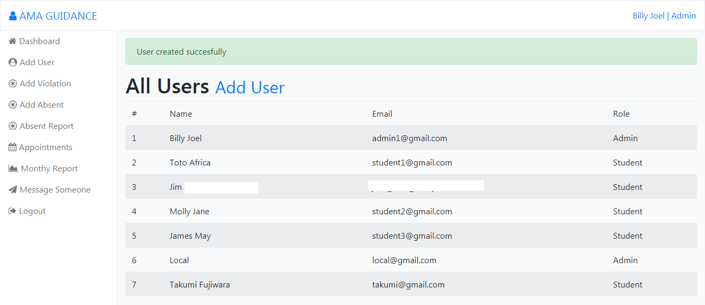
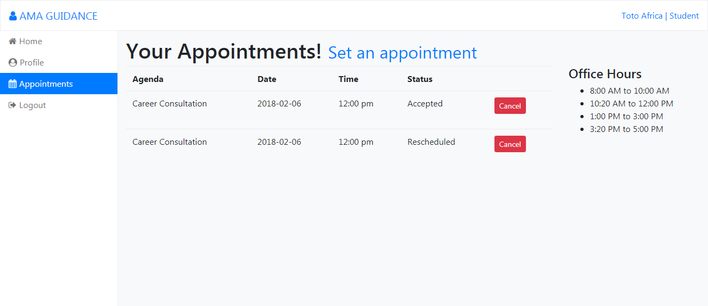

This is the version 2 of the Guidance office web application that is built using Laravel.

# What can it do?

* Simple records management.
* Simple user management.
* Simple live search using ajax.
* Simple appointments scheduler.
* Generate user friendly summary data report with .xls, .csv or .pdf files.
* SMS using iTexMo API

# Screenshots
### About Form

### Add Absent Form

### Added Absent Successful

### Absent Report Form

### Add User Form

### Add Violation Form

### Admin Dashboard

### Student Profile Admin View

### Appointments Admin View

### Father Information Form

### Guardian Information Form

### Login Form

### Summary Report Query Form

### Mother Information Form

### Organizational Affiliations Form

### Register Successful Redirect

### Scholastic Record Form

### Appointment Request Form

### Sibling Information Form

### SMS Form

### Student Search Form

### Student's Appointments

### Student Information Form 

### Student Profile Student View

### Violation Edit Form

### Added Violation Successful
